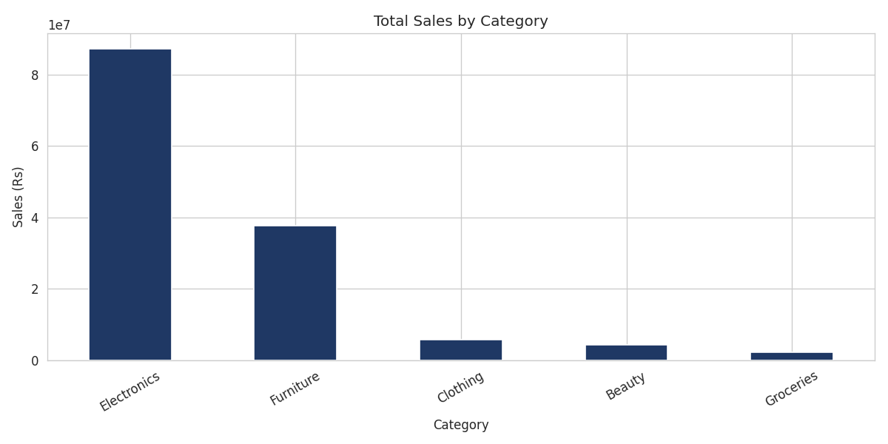
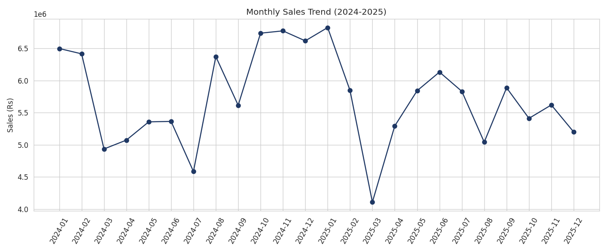
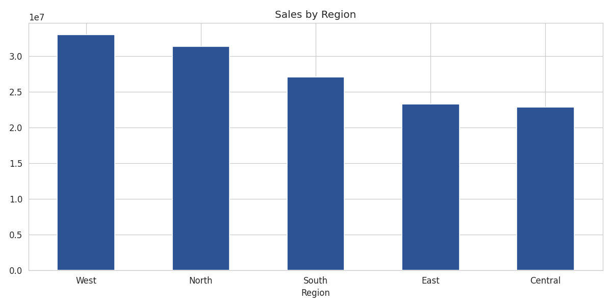
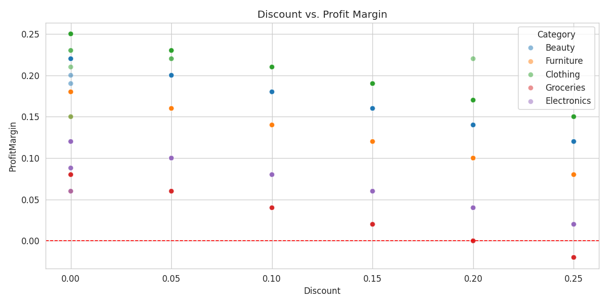

# 🛒 Retail Sales Analytics — End-to-End Data Analysis Project

**Author:** Yasar Khan Sattar Khan Pathan
**Tools:** Python (Pandas, NumPy, Matplotlib, Seaborn) · SQL · Power BI

An end-to-end data analysis project simulating a retail company's sales data —
covering data generation, cleaning, exploratory analysis, SQL querying, and an
interactive Power BI dashboard.

## 📌 Project Overview
This project analyzes 2 years (2024–2025) of retail sales data across 5 product
categories, 5 regions, and 3 customer segments to answer:
- Which categories and regions drive the most revenue and profit?
- How do discounts affect profit margins?
- What are the monthly sales trends and growth rates?
- Which customer segment contributes most to sales?

## 🗂️ Repository Structure
```
retail-sales-analysis/
├── data/
│   ├── generate_data.py          # Synthetic dataset generator
│   ├── retail_sales_raw.csv      # Raw dataset (with intentional messiness)
│   └── retail_sales_clean.csv    # Cleaned, analysis-ready dataset
├── notebooks/
│   └── retail_sales_analysis.ipynb   # Full Python EDA notebook
├── sql/
│   └── analysis_queries.sql      # Schema + 8 analytical SQL queries
├── powerbi/
│   └── PowerBI_Guide.md          # DAX measures & dashboard build guide
├── images/
│   ├── sales_by_category.png
│   ├── monthly_sales_trend.png
│   ├── sales_by_region.png
│   ├── sales_by_segment.png
│   └── discount_vs_margin.png
└── README.md
```

## 🔧 Workflow
1. **Data Generation** — Simulated 5,000+ realistic retail transactions.
2. **Data Cleaning** (Python) — Removed duplicates, standardized text fields,
   handled missing values, engineered features (`ProfitMargin`, `ShippingDays`).
3. **Exploratory Analysis** (Python) — KPI calculation, category/region/segment
   breakdowns, discount-vs-margin analysis, monthly trend analysis.
4. **SQL Analysis** — Rewrote key insights as SQL queries using joins, CTEs,
   window functions (`RANK`, `LAG`), and a reusable view.
5. **Dashboard** (Power BI) — DAX measures for YTD/YoY/MoM growth and an
   interactive multi-page dashboard (see `powerbi/PowerBI_Guide.md`).

## 📊 Key Insights
- **Electronics and Furniture** generate ~85% of total revenue but carry
  thinner margins than Clothing and Beauty.
- Discounts above **15–20%** push a meaningful number of orders into
  negative profit margin — a clear candidate for discount policy review.
- **Consumer segment** drives the largest share of sales, with room to grow
  Corporate segment penetration.
- Regional performance is fairly balanced, with **West** and **North**
  slightly ahead of other regions.

## 📈 Sample Visuals
| Sales by Category | Monthly Sales Trend |
|---|---|
|  |  |

| Sales by Region | Discount vs. Profit Margin |
|---|---|
|  |  |

## ▶️ How to Run
```bash
# 1. Clone the repo
git clone https://github.com/<your-username>/retail-sales-analysis.git
cd retail-sales-analysis

# 2. Install dependencies
pip install pandas numpy matplotlib seaborn jupyter

# 3. (Optional) Regenerate the raw dataset
python data/generate_data.py

# 4. Launch the notebook
jupyter notebook notebooks/retail_sales_analysis.ipynb
```

## 🧰 Skills Demonstrated
`Data Cleaning` `Exploratory Data Analysis` `Python (Pandas/NumPy)`
`Data Visualization (Matplotlib/Seaborn)` `SQL (CTEs, Window Functions, Views)`
`Power BI` `DAX` `Business/KPI Reporting`

---
*This is a portfolio project built on synthetic data for demonstration purposes.*
